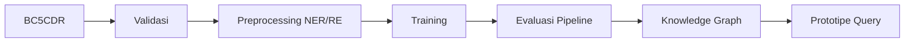

# ENEXRE

Repositori kode penelitian untuk ekstraksi entitas **Chemical–Disease** dan relasi **Chemical-Induced Disease (CID)** dari dataset BC5CDR menggunakan pendekatan NER–RE berbasis PubMedBERT serta integrasi knowledge graph.

## Sumber

- Dataset resmi BC5CDR: <https://ftp.ncbi.nlm.nih.gov/pub/lu/BC5CDR/>
- Panduan protokol: [`PENELITIAN_STEP.md`](PENELITIAN_STEP.md)
- Notebook eksperimen: [`Protocol.ipynb`](Protocol.ipynb)

## Instalasi

```powershell
bash setup_venv.bash
.venv/Scripts/python.exe -m pip install -r requirements.txt
```

## Alur Eksperimen



Validasi dan preprocessing:

```powershell
.venv/Scripts/python.exe scripts/validate_bc5cdr.py
.venv/Scripts/python.exe scripts/build_ner_dataset.py
.venv/Scripts/python.exe scripts/build_re_dataset.py
```

Smoke test pada CPU:

```powershell
.venv/Scripts/python.exe scripts/train_ner.py --smoke-test --cpu
.venv/Scripts/python.exe scripts/train_re.py --smoke-test --cpu
```

Training penuh sebaiknya dijalankan menggunakan GPU:

```powershell
.venv/Scripts/python.exe scripts/train_ner.py
.venv/Scripts/python.exe scripts/train_re.py
```

Evaluasi:

```powershell
.venv/Scripts/python.exe scripts/evaluate_ner.py
.venv/Scripts/python.exe scripts/evaluate_re.py
.venv/Scripts/python.exe scripts/evaluate_pipeline.py --cpu
```

## Knowledge Graph dan Prototipe

### Menjalankan Neo4j dengan Docker

Pastikan Docker Desktop sudah aktif, lalu buat artefak graph dan jalankan Neo4j:

```powershell
.venv/Scripts/python.exe scripts/build_graph.py
docker compose -f docker-compose.neo4j.yml up -d
```

Neo4j dapat dibuka pada:

```text
Browser: http://localhost:7474
Bolt:    bolt://localhost:7687
Username: neo4j
Password: enexre12345
```

File CSV pada `data/graph/` otomatis tersedia di dalam container sebagai
`/var/lib/neo4j/import/`. Jalankan isi [data/graph/neo4j_import.cypher](data/graph/neo4j_import.cypher)
di Neo4j Browser untuk mengimpor node dan relationship. Setelah itu, jalankan
query validasi dari [data/graph/neo4j_validation_queries.cypher](data/graph/neo4j_validation_queries.cypher).

Untuk mengganti password, buat file `.env` di root repository:

```dotenv
NEO4J_USER=neo4j
NEO4J_PASSWORD=password
```

Kemudian buat ulang container:

```powershell
docker compose -f docker-compose.neo4j.yml down
docker compose -f docker-compose.neo4j.yml up -d
```

Catatan: password Neo4j hanya diterapkan ketika database pertama kali dibuat.
Jangan memasukkan file `.env` ke Git.

```powershell
.venv/Scripts/python.exe scripts/build_graph.py
.venv/Scripts/python.exe scripts/flask_graph_app.py
.venv/Scripts/python.exe scripts/prototype_app.py --host 127.0.0.1 --port 8000
```

Visualisasi knowledge graph dan fitur query tersedia pada `http://127.0.0.1:5000`.
Antarmuka prototipe sistem NER–RE tersedia pada `http://127.0.0.1:8000`.

## Struktur Utama

```text
configs/        konfigurasi model NER dan RE
data/           dataset, data terproses, dan artefak graph
scripts/        preprocessing, training, evaluasi, dan aplikasi
results/        metrik, laporan, dan validasi
predictions/    hasil prediksi
checkpoints/    checkpoint model lokal
Protocol.ipynb  notebook penelitian
```
